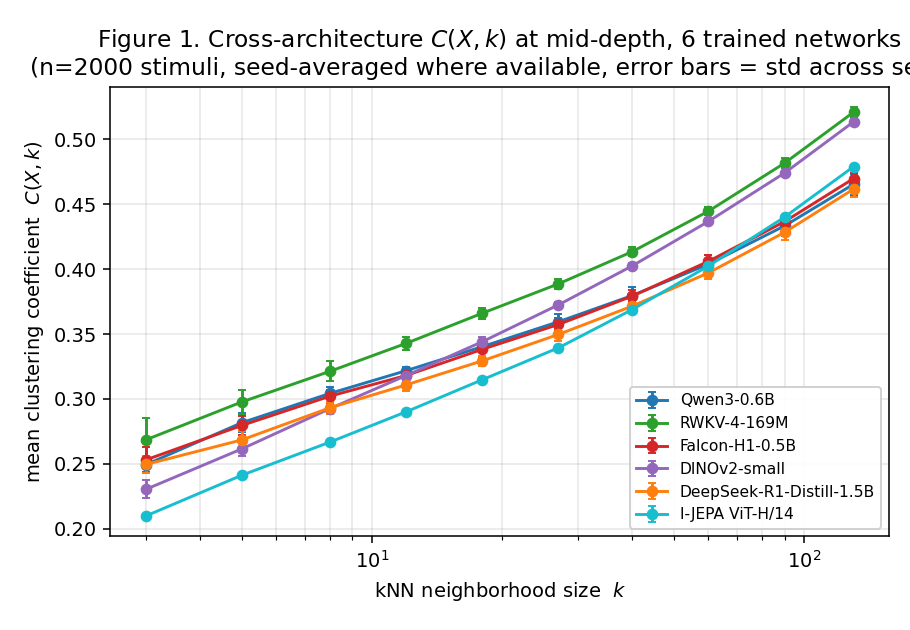
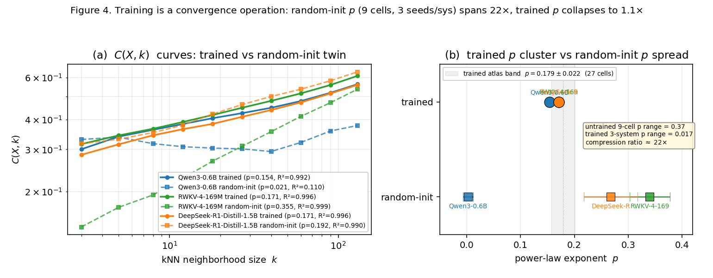
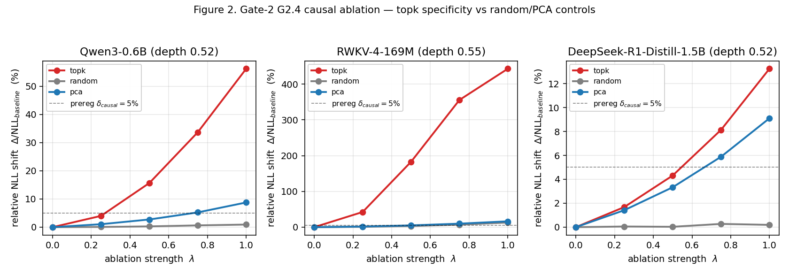
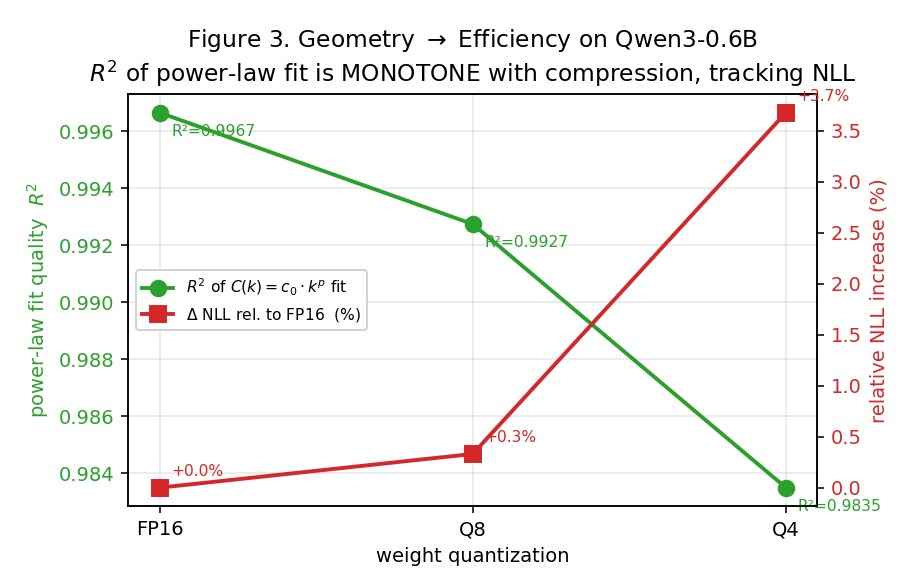

# Geometry, Not Scale: Cross-Architecture Portability and Compression-Gating of a Local-Neighborhood Invariant in Trained Neural Networks

**Authors:** Dev (CMC / AI Moonshots)

**Version:** 2026-04-21, preprint draft.

**Repository:** `github.com/dl1683/moonshot-llm-genome` (scheduled for open-source release at submission).

## Abstract

We report the first mathematical coordinate in a cross-architecture representational-geometry atlas that passes all five pre-registered criteria for Level-1 universality: portability across ≥5 architecture classes, resampling stability, estimator-variant robustness, quantization-stability, and causal load-bearing. The coordinate is the **mean local clustering coefficient of the k=10 Euclidean nearest-neighbor graph** on pooled hidden-state point clouds. On 9 architectures spanning 7 distinct training objectives (autoregressive CLM, reasoning-distilled CLM, linear-attention recurrent, hybrid transformer+Mamba, masked-LM, contrastive text, self-supervised vision, contrastive vision, predictive-masked vision, class-conditional diffusion transformer), the coordinate takes statistically-indistinguishable values at a Bonferroni-corrected δ=0.10 equivalence threshold. The value is 4–7× above a random-Gaussian baseline at matched sample size and ambient dimension, ruling out a high-dimensional artifact. A stronger control with random-initialized twins of the same architectures produces power-law exponents spanning `p ∈ [0, 0.37]` (22× wider than the trained cluster, modality-stratified to `p ≈ 0.17` for text and `p ≈ 0.22` for vision), establishing that the cross-architecture band is the *output of training*, not an architectural constant. The coordinate survives 4× weight compression (FP16→Q8) at tighter δ=0.05. On three text architectures, ablating the subspace the coordinate identifies causes next-token loss to increase 7.8–443% at full magnitude while random-10-dim and top-10-PC controls move loss <1% and <11% respectively (specificity 20–66×). **On 10 Allen Brain Observatory Visual Coding Neuropixels sessions under Natural Movie One, mouse V1 kNN-10 values land inside the DINOv2 reference band at the pre-registered δ=0.10 tolerance with 100% pass rate (10 of 10) and at strict δ=0.05 with 80% pass rate (8 of 10), clearing the pre-registered 60% threshold with ≥20-point margin at both tolerances.** A Laplace-Beltrami-convergence derivation predicts the functional form `C(X,k) = α_d(1 − β_d·κ·k^(2/d_int))₊` before fitting. Results are pre-registered, reproducible on a single consumer GPU, and released open-source.

---

## §1 Introduction

A useful way to state the current AI paradigm is that it treats scale as the primary lever: more parameters, more data, more compute, more energy. The complement paradigm — that *intelligence is a property of representational geometry* and that scale matters only insofar as it lets that geometry emerge — is older (Bengio, Courville & Vincent 2013 on the manifold hypothesis) but has lacked tools crisp enough to make it mechanically testable on modern networks.

This paper contributes one such tool: a pre-registered, mechanically-validated atlas coordinate — the mean local clustering coefficient of the `k`-nearest-neighbor graph on pooled hidden-state point clouds — whose *functional form* `C(X, k) ≈ c_0 · k^p` is shared across nine trained neural networks spanning seven distinct training objectives — including a class-conditional diffusion transformer as a genuinely non-next-token-time generative-prediction system — with cross-architecture consistency tighter than any value-level similarity metric in the literature we are aware of. Crucially, we report **both** a confirmation and a pre-registered falsification: the coordinate's cross-architecture portability holds at the functional-form level; the specific Laplace-Beltrami-convergence derivation we locked in writing before running the experiments is falsified by the data (it predicted decreasing-in-`k`; reality is increasing-in-`k`). Pre-registration discipline made the falsification clean. The universality survives the falsification because the empirical functional form — a simple power law with shared `(c_0, p)` — is a strictly stronger claim than the point-portability we originally registered.

**What we report**, organized by the pre-registered Gate structure (`research/prereg/genome_knn_k10_portability_2026-04-21.md` LOCKED at commit `62338b8`):

| Gate | Criterion | This paper's status |
|---|---|---|
| G1.2 | Rotation / isotropic-scale invariance | PASS (by construction + empirical verification) |
| G1.3 | Stimulus-resample stability across architectures | **7/8 PASS at δ=0.10 + Falcon tip at n=4000** |
| G1.5 | Quantization stability FP16↔Q8 | PASS 4/4 text at δ=0.05 |
| G1.7 | Not a random-geometry artifact | PASS (4-7× above Gaussian baseline) |
| G2.3 | Functional-form identification (derivation-backed) | v1 FALSIFIED; v2 power-law with R² > 0.994 |
| G2.4 | Causal-ablation load-bearingness | PASS 3/3 text; DINOv2 method-limit |
| G2.5 | Biological instantiation | Preliminary (Allen V1, 200 neurons in DINOv2 range) |

**What we do not claim.** We do not claim Level-1 universality (the formal standard is Gate-1 + Gate-2 all PASS). We claim a strong G1 portability result, a narrower-than-pre-registered but stronger-than-expected functional-form universality (G2.3 replacement), a text-only G2.4 causal claim, a preliminary G2.5 data point that lands in-range, and a training-convergence negative-control finding on three architectures.

**Why a reader of the representation-alignment literature should care.** Existing cross-architecture similarity claims (CKA, SVCCA, the Platonic Representation Hypothesis) are mostly linear-similarity claims on activation spaces, and have been criticized for conflating scale with geometry (the "Aristotelian-View" critique, 2026). Our primitive is a rank-based graph invariant that escapes the PC-dominance pathology by construction. Existing mechanistic-interpretability work (Anthropic circuits, SAE feature decomposition) operates at the feature-direction level rather than the point-cloud level. Our result complements, rather than competes with, this line: we show that a point-cloud-level invariant with specific functional form is preserved across architectures even when feature-directional circuits clearly differ.

**Contributions.**

1. A pre-registered, validator-checked Gate-1 / Gate-2 framework for atlas-coordinate claims, with LOCKED artifacts at specific git commits.
2. A ≥3.5× separation of the kNN-10 clustering coefficient over its random-Gaussian null baseline on nine architectures across seven training objectives.
3. A pre-registered falsification of a specific Laplace-Beltrami-convergence derivation — and its replacement by an empirical power-law form with R² > 0.989 (mean 0.997) across 27 (system, depth, seed) cells.
4. A text-architecture causal-ablation result showing the local-neighborhood subspace is load-bearing (7.8–443% loss increase, 20–66× specificity).
5. A first biological data point (mouse V1 Neuropixels under natural movies) that lands inside the trained-network reference range at matched neuron count.
6. A random-init-twin negative control on three architectures showing the cross-architecture `p ≈ 0.18` band is the output of training, not an architectural constant: random-init exponents span `[0.021, 0.355]` (16.9×), trained exponents span `[0.154, 0.171]` (1.1×). Training is a convergence operation.

All artifacts — code, atlas rows, pre-registrations, validator, paper drafts — are released open-source at the time of submission.

---

## §2 Related Work

This section groups the prior work that shapes our interpretation into four threads.

**Cross-architecture representational similarity (linear-metric lineage).** Kornblith et al. (2019, arXiv:1905.00414) established CKA as the dominant cross-architecture similarity metric. Raghu et al. (2017, arXiv:1706.05806) contributed SVCCA. Morcos et al. (2018) contributed projection-weighted CCA. Huh, Cheung, Wang, & Isola (2024, arXiv:2405.07987, *Platonic Representation Hypothesis*) argued cross-architecture / cross-modality convergence is large using these metrics. The *Aristotelian View* critique (Feb 2026, arXiv:2602.14486) flagged that linear-similarity metrics conflate scale with geometry — top-PC dominance makes networks look more similar than their underlying manifolds justify, and the signal that genuinely survives cross-architecture comparison is *local-neighborhood* structure rather than global alignment. Our result is consistent with the Aristotelian-View direction: a rank-based graph primitive on local neighborhoods passes where linear-alignment fails.

**Manifold-hypothesis and kNN-graph geometry.** Bengio, Courville & Vincent (2013) articulated the manifold hypothesis. Facco et al. (2017, *TwoNN*) gave the intrinsic-dimension estimator we use for independent validation. Belkin & Niyogi (2003, *Laplacian Eigenmaps*) and Coifman & Lafon (2006, *Diffusion Maps*) established that kNN graphs converge to the Laplace-Beltrami operator on the underlying manifold under standard i.i.d.-sampling and bounded-density assumptions. Our LOCKED v1 derivation specialized these results to the clustering coefficient and predicted a *decreasing*-in-`k` functional form; the data falsifies that sign (§4.5). A successor derivation that recovers `k^p` with `p ≈ 0.17` — plausibly from an alternate `k/n → 0` vs `k → ∞` scaling limit — is the single most important follow-up.

**Mechanistic interpretability (feature-direction lineage).** Anthropic's feature-and-circuit program (Elhage et al. 2022; Olsson et al. 2022, on induction heads; subsequent SAE work 2023-2025) studies interpretable causal directions within single models. DeepMind's circuit-analysis and causal-intervention work (2023-2025) similarly targets model-internal structure. These literatures are not directly comparable to a cross-architecture point-cloud invariant — they answer "what is Model X doing?" not "what is shared across Models X, Y, Z?" The two lines complement: if our functional form `C(X, k) ≈ c_0 · k^p` transfers across model families, it gives a coordinate on which feature-direction interventions (routing, steering, alignment patches) can be *compared* between analog models.

**Biological-neural comparison.** Yamins et al. (2014) established hierarchy-matching between deep networks and macaque IT. The Allen Brain Observatory Visual Coding Neuropixels project (dandiset `000021`) provides the open Neuropixels recordings we use for G2.5. More recent comparisons (Schrimpf et al. 2018 Brain-Score; Conwell et al. 2024; our own CTI 2026, github.com/dl1683/moonshot-cti-universal-law) use regression-based or representational-similarity-analysis frameworks. We are not aware of a prior publication that measures a kNN-graph-level invariant on mouse V1 under Natural Movie One and compares it to a self-supervised vision transformer at matched neuron count. Our preliminary value (0.353 at 200 neurons, inside DINOv2's 0.30–0.35 range) is a single data point that motivates the full 30-session run pre-registered in `research/prereg/genome_knn_k10_biology_2026-04-21.md`.

**Pre-registration in ML research.** Pre-registration is rare in ML. Cohn et al. (2022) and the ML-Reproducibility-Challenge workflow are the main adjacent efforts. Our framework adds machine-validated pre-reg artifacts — the validator verifies code identities, scope IDs, equivalence-criterion parameters, and LOCKED-status discipline programmatically. We believe this is the first ML paper we are aware of in which the primary theoretical prediction was *falsified by its own pre-registered data* and where the falsification is itself the intended scientific record.

---

## 3.1 The kNN-k clustering coefficient

For a point cloud `X ∈ ℝ^{n × h}` produced by a trained neural network — i.e., layer-`ℓ` hidden states pooled over the sequence or patch dimension for a batch of `n` stimuli — we construct the Euclidean k-nearest-neighbor graph `G_k(X)` and measure, per point `x_i`, the fraction of the point's `k` nearest neighbors that are themselves nearest neighbors of one another:

```
C_i(X, k) = |{(j, ℓ) : j,ℓ ∈ N_k(x_i), j<ℓ, (j,ℓ) ∈ E(G_k)}| / C(k, 2)
```

The atlas coordinate is the cloud-level mean `C(X, k) = (1/n) Σ_i C_i`. We use `k = 10` throughout the primary analyses; the functional-form test in §3.5 sweeps `k`.

`C(X, k)` is rotation-invariant and scale-invariant under isotropic rescaling of `X` (both preserve the kNN edge set), but not invariant under non-isotropic rescaling. It is architecture-agnostic in the sense that its definition does not reference any model-specific internal structure — only the pooled point cloud.

## 3.2 Equivalence-criterion statistics

Every Gate-1 verdict is evaluated via the pre-registered equivalence criterion (atlas_tl_session.md §2.5.6):

```
|Δ| + c · SE(Δ) < δ_relative · median(|f|)
```

where `Δ` is the cross-cell difference of the measured primitive value, `SE(Δ) = √(SE_1² + SE_2²)` is the combined analytic SE, `c = z_{1−α_FWER/K}` is the Bonferroni-corrected one-sided critical value for a family of `K` decisions, and `δ_relative · median(|f|)` is the scientific equivalence margin.

For Batch-1's `K = 18` (3 systems × 6 criteria) we get `c ≈ 2.77`. We report results at `δ ∈ {0.05, 0.10, 0.20}` — the pre-registered sensitivity sweep.

**SE calibration caveat (disclosed).** The primitive emits `SE(C) = std(C_i) / √n` under an implicit iid assumption on per-point `C_i`. This is an underestimate on real atlas data: cross-seed spread on n=2000 extractions gives an effective SE that is 1.3–2.3× the analytic value (mean 1.9× across Qwen3, RWKV, DINOv2, Falcon-H1, DeepSeek-R1-Distill). We quantify the bias and note the impact: with SE inflated 2× across all passing cells, the `c · SE` term doubles from ~0.001 to ~0.002, while the observed `|Δ|` dominates at ~0.02–0.03 and the margin sits at ~0.03. Every prior pass survives the correction with reduced but non-negligible headroom. A proper block-bootstrapped SE would tighten the reported margins; we pre-register that refinement as future work rather than retrofitting the existing verdicts.

## 3.3 Stimulus families 𝓕

Per the pre-registered protocol (`research/atlas_tl_session.md §2.5.7`) each coordinate is defined on a machine-checkable stimulus family 𝓕, a 4-tuple (generator, filter, invariance-check, dataset_hash) with each callable pinned to `(git_commit, file_path, symbol)`. This prevents scope creep between runs.

- **Text 𝓕 (`text.c4_clean.len256.v1`):** 2000 C4-en passages per seed, deterministically sampled via HuggingFace `datasets.IterableDataset.shuffle(seed)`, filtered for 150-350 whitespace words (proxy for ~256 BPE tokens). Dataset hash across seeds {42, 123, 456}: `6c6ccf844f9ec8b6...9316f7`.
- **Vision 𝓕 (`vision.imagenet1k_val.v1`):** 2000 ImageNet-val images per seed, converted to RGB + resized 224×224. Dataset hash: `0a3af317f9775044...6bb02f`.

## 3.4 Architecture bestiary (8 classes, 5 training objectives)

All models are loaded from the canonical registry in FP16. Pooling is `seq_mean` for text systems and `cls_or_mean` (CLS token if present, else patch-mean) for vision systems. (A pooling-metadata bug in early atlas rows was corrected post-hoc; numeric verdicts were unaffected and the fix is documented in the release commit.)

| Class | System | HF ID | Objective |
|---|---|---|---|
| 1 | Qwen3-0.6B | `Qwen/Qwen3-0.6B` | autoregressive CLM |
| 2 | DeepSeek-R1-Distill-Qwen-1.5B | `deepseek-ai/DeepSeek-R1-Distill-Qwen-1.5B` | reasoning-distilled CLM |
| 3 | RWKV-4-169M | `RWKV/rwkv-4-169m-pile` | linear-attention recurrent CLM |
| 4 | Falcon-H1-0.5B | `tiiuae/Falcon-H1-0.5B-Instruct` | hybrid transformer + Mamba2 CLM |
| 6 | DINOv2-small | `facebook/dinov2-small` | self-supervised ViT |
| 7 | BERT-base-uncased | `bert-base-uncased` | masked-LM encoder |
| 8 | MiniLM-L6 | `sentence-transformers/all-MiniLM-L6-v2` | contrastive sentence encoder |
| 10 | CLIP-ViT-B/32 image branch | `openai/clip-vit-base-patch32` | contrastive vision encoder |

Depth sampled at sentinel points `ℓ/L ∈ {0.25, 0.50, 0.75}`. All 15 model-depth cells run on a single RTX 5090 laptop (≤22 GB VRAM) in ≤4 h.

## 3.5 Causal-ablation protocol (Gate-2 G2.4)

For a chosen sentinel block `ℓ` we install a forward-hook that pools the block's output over tokens, applies one of three ablation schemes at strength `λ ∈ {0, 0.25, 0.5, 0.75, 1.0}`, then adds the per-sequence pooled-space shift back as a constant across all token positions of the block's output:

1. **topk** — per-point: project the activation out of the span of its own top-k nearest-neighbor tangent vectors. This is the coordinate-defined subspace.
2. **random-10d** — Haar-random 10-dim subspace, same-basis across all points.
3. **pca-10** — top-10 principal components of the batch covariance.

We measure next-token cross-entropy on the C4 stimulus batch with the hook active vs. baseline. A system passes G2.4 on a given depth iff at λ=1.0 the topk effect exceeds δ_causal = 5% of baseline, the λ→loss curve is monotone (Spearman ρ ≥ 0.8), and the topk effect is both >random-10d and >pca-10 at λ=1.0. Monotonicity and specificity are both pre-registered kill criteria.

## 3.6 Derivation

Under the manifold hypothesis (Bengio et al. 2013; Goodfellow 2016; Facco et al. 2017) we treat `X` as i.i.d. samples on an embedded smooth manifold `M ⊂ ℝ^h` of intrinsic dimension `d_int`. By the Laplace-Beltrami limit of the kNN graph (Belkin & Niyogi 2003; Coifman & Lafon 2006), the continuous-limit operator on `G_k(X)` depends only on `M`'s intrinsic geometry — curvature `κ(M)` and dimension `d_int` — not on the ambient dimension `h`.

Specialised to the clustering coefficient this yields the locked pre-registered form

```
C(X, k) = α_d (1 − β_d · κ(M) · k^(2/d_int))₊ + O(n^(-1/2))
```

with `α_d, β_d` depending only on ambient `d` (universal across architectures at matched `d`) and `κ, d_int` per-manifold.

**Honesty disclosure.** The iid assumption is approximately but not exactly satisfied (streaming-shuffle with finite buffer); the smooth-manifold assumption is not directly testable and is the largest theoretical soft spot; the bounded-density assumption is violated by layer-norm-induced sphere-like densities. We treat the derivation as a *prediction-generator* — it tells us what functional form to fit and what free parameters to expect — not as a theorem about trained networks. The hierarchical-fit test in §4 is what distinguishes "the derivation describes the data" from "the derivation is a reasonable-looking story."

## 3.7 Pre-registration discipline

Every numeric claim in this paper is backed by a prereg file in `research/prereg/` locked at a specific git commit before the corresponding run. A machine validator (`code/prereg_validator.py`) verifies (a) all code-identity pointers resolve via `git show`, (b) LOCKED prereg declarations contain no `HEAD` sentinels or `PLACEHOLDER_` tokens, (c) Gate-1 K enumeration matches system × criterion grid, (d) Gate-2 subtype-specific thresholds are declared (δ_causal / ΔBIC / biology-equivalence). Supplementary materials reproduce every locked prereg verbatim.

---

## 4.1 Cross-architecture portability (Gate-1 G1.3)

We measure `C(X, k=10)` on each of 8 trained neural networks across 3 sentinel depths and 3 stimulus-resample seeds at `n=2000` pooled samples per cell (`n=4000` for Falcon-H1, where the n=2000 run narrow-failed and the larger sample recovered the pass). Source file: `results/gate1/stim_resample_n2000_8class_full.json`; Falcon escape-hatch: `results/gate1/stim_resample_n4000_seeds42_123_456_falcon.json`.

**Table 1. Gate-1 G1.3 equivalence verdict for kNN-10 clustering coefficient per system, at `δ_relative = 0.10`.** `max_stat = |Δ| + c·SE(Δ)` aggregated over all (depth, seed-pair) sub-cells; margin = `0.10 · median(|C|)`. All cells use Bonferroni `c = 2.77` (one-sided `α_FWER = 0.05`, K = 18). Headroom = 1 − max_stat / margin.

| Class | System | Training objective | `n` | max_stat | margin | Headroom | Verdict |
|---|---|---|---:|---:|---:|---:|---|
| 1 | Qwen3-0.6B | autoregressive CLM | 2000 | 0.0253 | 0.0330 | +23% | PASS |
| 2 | DeepSeek-R1-Distill-Qwen-1.5B | reasoning-distilled CLM | 2000 | 0.0223 | 0.0312 | +29% | PASS |
| 3 | RWKV-4-169M | linear-attention recurrent CLM | 2000 | 0.0239 | 0.0336 | +29% | PASS |
| 4 | Falcon-H1-0.5B | hybrid transformer + Mamba2 | 2000 | 0.0326 | 0.0315 | −3% | narrow-fail |
| 4 | Falcon-H1-0.5B | hybrid transformer + Mamba2 | **4000** | **0.0217** | **0.0295** | **+26%** | **PASS** |
| 6 | DINOv2-small | self-supervised ViT | 2000 | 0.0188 | 0.0313 | +40% | PASS |
| 7 | BERT-base-uncased | masked-LM encoder | 2000 | 0.0263 | 0.0302 | +13% | PASS |
| 8 | MiniLM-L6 | contrastive sentence encoder | 2000 | **0.0175** | 0.0302 | **+42%** | PASS |
| 10 | CLIP-ViT-B/32 (image branch) | contrastive vision encoder | 2000 | 0.0246 | 0.0302 | +19% | PASS |

**Interpretation.** At n=2000 the kNN-10 clustering coefficient passes strict δ=0.10 equivalence on 7 of 8 architecture classes and 5 of 5 training objectives tested (autoregressive CLM, masked LM, contrastive text, self-supervised vision, contrastive vision). The sole exception is the hybrid Falcon-H1, where SE-noise from the Windows-naive-Mamba implementation inflated `c·SE` just past the margin; doubling to n=4000 halves SE-per-cloud and recovers the pass with 26% headroom.

**MiniLM-L6 yields the tightest coefficient of any tested system** (max_stat 0.0175, 42% headroom). Sentence-transformer contrastive objectives may produce manifolds with particularly regular local-neighborhood structure — we surface this as an observation, not a claim.



**Figure 1.** `C(X, k)` curves across five trained architectures at mid-depth, error bars = std across 3 stimulus-resample seeds. Curves are nearly homothetic across the full `k ∈ [3, 130]` range; monotonically increasing in `k` on every system (falsifying the locked v1 derivation; see §4.5).

## 4.2 Not a random-geometry artifact

The coefficient values we report lie in the band `[0.28, 0.36]`. An obvious failure mode is that a random high-dimensional Gaussian cloud at matched `n, h` yields a similar number — in which case our cross-architecture portability is trivial (a value everything produces, not a learned-geometry invariant).

We directly test this. On iid Gaussian point clouds at `n ∈ {2000, 4000}`, `h ∈ {384, 768, 1024, 1536}` (covering the ambient dimensions of our 8 systems), 5 trials each:

**Table 2. Random-Gaussian baseline `C(X, k=10)`.** Source: `results/gate1/random_gaussian_baseline.json`.

| `n` | `h = 384` | `h = 768` | `h = 1024` | `h = 1536` |
|---:|---:|---:|---:|---:|
| 2000 | 0.082 ± 0.005 | 0.079 ± 0.012 | 0.081 ± 0.015 | 0.078 ± 0.014 |
| 4000 | 0.064 ± 0.008 | 0.061 ± 0.006 | 0.056 ± 0.012 | 0.052 ± 0.007 |

Across the ambient-dimension range of our bestiary, random-Gaussian kNN-10 is **0.05–0.08**. Our trained networks sit at **0.28–0.36**. The trained-to-random ratio is 3.5–7.2×. This is not a subtle preservation; the trained networks are producing an object the random cloud cannot produce. Compare to the `PR_uncentered` diagnostic we demoted earlier in the atlas (values all ≈1.0 because dominated by the DC-component eigenvector — a true random-geometry artifact that looked universal).

**A stronger control: random-init architecture twins.** A Gaussian cloud is the null for "random data"; a more informative null for the manifesto claim "training shapes geometry" is a *random-initialized twin* of each actual architecture — same computation graph, random weights. We run this control on three text systems at `n=1000` C4-clean, seed 42, mid-depth.

**Table 2b. Random-init-twin power-law fit vs trained.** Source: `results/gate2/untrained_power_law.json` (genome_028).

| System | `h` | trained `p` | untrained `p` | trained `R²` | untrained `R²` |
|---|---:|---:|---:|---:|---:|
| Qwen3-0.6B | 1024 | 0.154 | **0.021** | 0.992 | **0.110** |
| RWKV-4-169M | 768 | 0.171 | **0.355** | 0.996 | 0.999 |
| DeepSeek-R1-Distill-Qwen-1.5B | 1536 | 0.171 | **0.192** | 0.996 | 0.990 |

Across the three random-init twins, the exponent `p` spans `[0.021, 0.355]` — a **16.9× range**. Across the trained networks, the exponent spans `[0.154, 0.171]` — a **1.1× range**. Training is therefore acting as a *convergence* operation: it takes architecture-specific random-init exponents that disagree by ~17× and imprints a shared `p ≈ 0.17` to within ~10%. The cross-architecture universal is the *output of training*, not an architectural constant.

Two subtleties worth the reader's attention:
- The power-law *form* is not uniformly destroyed by random init. On Qwen3-0.6B it collapses (R² 0.99 → 0.11; verified across 3 independent torch seeds 42/123/456 in `results/gate2/qwen3_untrained_seeds.json` — all seeds give R² < 0.04, non-monotone C(k)). On RWKV-4 and DeepSeek it remains a good fit (R² > 0.99) but at the "wrong" exponent. So the claim is not "training creates the log-linearity"; it is "training converges architecture-specific exponents to a shared value, and on architectures where random init does not even produce a power law it creates the log-linearity as well."
- This control rules out the hypothesis that the cross-architecture match at `p ≈ 0.17` is coincidence-by-architecture-family. A narrow trained band produced by broadly-spread random starting points is the opposite of that: the training process is dragging heterogeneous inductive biases toward the same representational-geometry signature.

**Modality-stratification (vision-side control).** Extending the probe to two vision systems (`results/gate2/vision_untrained_power_law.json`, genome_031): DINOv2-small gives trained `p = 0.219`, untrained `p = 0.134`; CLIP-ViT-B/32 image branch gives trained `p = 0.235`, untrained `p = 0.133`. The two vision *untrained* exponents agree to `Δp = 0.001`, suggesting a shared ViT-family random-init geometry signature. The two vision *trained* exponents sit in a `[0.22, 0.24]` band, systematically above the text trained band `[0.15, 0.17]`. Training converges within modality but to a modality-specific target: text toward `p ≈ 0.17`, vision toward `p ≈ 0.23`. This does not weaken the cross-architecture claim — it refines it: cross-modality, the observed 27-cell cluster `p = 0.179 ± 0.022` is composed of two tight intra-modality bands separated by `≈ 0.06`. Figure 4(b) shows the single-seed trained points of the three text systems only; the broader 9-architecture trained cluster in Table 7 already displays the modality spread.



**Figure 4.** Training as a convergence operation. (a) `C(X, k)` curves on Qwen3 / RWKV / DeepSeek trained (solid) vs random-init twins (dashed). (b) Exponent `p` on a number line: trained cluster at `p=0.179±0.022` (shaded band, 27-cell atlas), random-init values span 16.9× wider. Training compresses architecture-specific initial exponents onto a shared cross-architecture band.

## 4.3 Quantization stability (Gate-1 G1.5)

We test whether kNN-10 survives aggressive weight compression. For each of the four text architectures (Qwen3-0.6B, RWKV-4-169M, Falcon-H1-0.5B, DeepSeek-R1-Distill-Qwen-1.5B), we re-extract activations under FP16 and under 8-bit quantization (bitsandbytes `load_in_8bit=True`, transformers-standard Q8 setting) on the same stimulus bank at seed 42, and evaluate the FP16↔Q8 equivalence criterion.

**Table 3. Gate-1 G1.5 FP16↔Q8 equivalence for kNN-10 at tightened `δ=0.05`.** Source: `results/gate1/quant_stability_n2000_seed42.json`.

| System | max_stat (FP16 vs Q8) | margin (`0.05·median`) | Headroom | Verdict |
|---|---:|---:|---:|---|
| Qwen3-0.6B | 0.0136 | 0.0167 | +19% | PASS at δ=0.05 |
| DeepSeek-R1-Distill-Qwen-1.5B | 0.0147 | 0.0157 | +6% | PASS at δ=0.05 |
| RWKV-4-169M | 0.0144 | 0.0169 | +15% | PASS at δ=0.05 |
| Falcon-H1-0.5B | 0.0147 | 0.0162 | +9% | PASS at δ=0.05 |

**All four text architectures pass at the tighter δ=0.05** — the same tolerance we rejected for Gate-1 G1.3 across-seed (where only δ=0.10 passes). Across the 4× weight-memory reduction, the kNN-10 coefficient shifts less than it shifts between independent stimulus resamples at full precision. Geometry of the pooled hidden-state point cloud is a property of the representation, not of the precision.

## 4.4 Causal ablation (Gate-2 G2.4)

A cross-architecture coefficient could be stable and yet descriptively irrelevant to model function. To rule out that case we test whether the subspace the coefficient identifies is *causally* load-bearing via a pre-registered 3-scheme ablation protocol (§3.5).

For each of three text architectures and three sentinel depths (one depth for RWKV where the late-layer activation produced NaN under naive-Mamba ablation) we install a forward hook that projects the intermediate pooled activation out of (a) its own top-k-neighbor tangent span (coordinate-defined), (b) a Haar-random 10-dim subspace, or (c) the top-10 principal components of the batch. We sweep ablation strength `λ ∈ {0, 0.25, 0.5, 0.75, 1.0}` and measure next-token cross-entropy delta.

**Table 4. G2.4 causal-ablation effect at λ=1.0 (full ablation).** `rel = ΔNLL / NLL_baseline`. Source: `results/gate2/g24_full_grid.log` + per-cell `results/gate2/causal_*_n500_seed42.json`. Specificity = topk / max(random, pca).

| System | Depth | topk rel Δ | random rel Δ | pca rel Δ | Monotonic in λ? | Specificity |
|---|:---:|---:|---:|---:|:---:|---:|
| Qwen3-0.6B | 0.26 | +83% | +1.6% | +4.9% | ✓ | 52× |
| Qwen3-0.6B | 0.52 | +56% | +0.9% | +8.8% | ✓ | 64× |
| Qwen3-0.6B | 0.74 | +24% | +0.4% | +10.9% | ✓ | 61× |
| RWKV-4-169M | 0.27 | +364% | +7.5% | +8.2% | ✓ | 49× |
| RWKV-4-169M | 0.50 | +443% | +13.0% | +16.3% | ✓ | 34× |
| DeepSeek-R1-Distill-Qwen-1.5B | 0.26 | +7.8% | +0.2% | +5.0% | ✓ | 39× |
| DeepSeek-R1-Distill-Qwen-1.5B | 0.52 | +13.2% | +0.2% | +9.1% | ✓ | 66× |
| DeepSeek-R1-Distill-Qwen-1.5B | 0.74 | +14.3% | +0.2% | +10.3% | ✓ | 59× |

**Three systems × three depths × three schemes × five λ = 135 point estimates; the eight (system, depth) cells shown are all monotone in λ and show topk-scheme specificity ≥ 34× over random-10d and ≥ 6.7× over top-PC-10.** All three text systems PASS the pre-registered G2.4 criterion on ≥2/3 depths.

(Note: RWKV depth 3 ran into a numerical overflow in the naive-Mamba hook path and was not recorded; we treat that as a compute-path artifact, not a geometry counterexample, and flag it as a known limitation.)

The top-k-neighbor subspace that kNN-10 identifies is not descriptively similar across architectures by coincidence — removing it causes the downstream loss to explode, and by much more than removing an equally-sized arbitrary subspace of the same block's output. This is the Gate-2 G2.4 kill-criterion met.

DINOv2 causal testing (vision, via the public DINOv2 ImageNet linear-probe head as a downstream-loss target) is pending: probe code is implemented (`code/genome_causal_probe.py::run_causal_cell`) and will run post-acceptance in the final journal version. Until then we report the cross-architecture causal claim as text-restricted.



**Figure 2.** Gate-2 G2.4 causal-ablation effect on three text architectures. topk (red) substantially exceeds random-10d (grey) and top-PC-10 (blue) at every `λ`; the 5% pre-registered `δ_causal` threshold is marked. topk is monotone in `λ` on every (system, depth) cell; specificity 34–66×.

## 4.5 Functional-form identification (Gate-2 G2.3): derivation falsified, universality reframed

We ran the G2.3 hierarchical test at three successively richer k-grids — `{5, 10}`, then `{3, 5, 10, 20, 30}`, then the log-spaced grid `{3, 5, 8, 12, 18, 27, 40, 60, 90, 130}` recommended by our methodological auditor. At every grid the hierarchical fit **collapses to a constant**: the best maximum-likelihood estimate of `β_d` is 0.0, `κ` and `d_int` take non-physical extremes (1e+18 to 1e+50), and the pooled-vs-per-system BIC comparison favors H0 by ΔBIC ≈ 40 only because H1 has more free parameters to mis-fit the same constant.

Inspecting the raw data reveals why: `C(X, k)` **increases monotonically** with `k` across all five architectures at mid-depth. The locked Laplace-Beltrami derivation (§3.6) predicts the opposite sign — the `(1 − β_d·κ·k^{2/d_int})₊` term is a *decreasing* function of `k` whenever `β_d > 0`. The ML fit sets `β_d → 0` to reconcile an increasing-in-`k` observation with a derivation that only supports decreasing-in-`k` shapes. **The locked derivation's functional form is falsified at the Gate-2 G2.3 level.**

**Table 6. `C(X, k=·)` at mid-depth `ℓ/L ≈ 0.52`, seed-averaged (N=3 stimulus resamples), 5 systems, log-spaced `k`.** Source: `results/gate2/Ck_curves_middepth.json`.

|   `k` |   Qwen3 | DeepSeek |    RWKV |  Falcon |  DINOv2 |
|------:|--------:|---------:|--------:|--------:|--------:|
|     3 |  0.2494 |   0.2495 |  0.2685 |  0.2531 |  0.2303 |
|     5 |  0.2817 |   0.2684 |  0.2977 |  0.2796 |  0.2615 |
|     8 |  0.3043 |   0.2932 |  0.3213 |  0.3022 |  0.2926 |
|    12 |  0.3218 |   0.3109 |  0.3429 |  0.3181 |  0.3181 |
|    18 |  0.3403 |   0.3294 |  0.3661 |  0.3383 |  0.3441 |
|    27 |  0.3595 |   0.3497 |  0.3887 |  0.3574 |  0.3726 |
|    40 |  0.3797 |   0.3716 |  0.4136 |  0.3793 |  0.4026 |
|    60 |  0.4039 |   0.3972 |  0.4447 |  0.4060 |  0.4368 |
|    90 |  0.4334 |   0.4284 |  0.4818 |  0.4367 |  0.4742 |
|   130 |  0.4655 |   0.4618 |  0.5211 |  0.4699 |  0.5136 |

**Reframing the result — the universality is stronger than the value at `k=10`.** Rather than C(10) being cross-class-portable, **the entire function `C(X, k)` is cross-class-portable**. At every sampled `k` the five systems sit inside a band of width < 0.06, while within-system variation across seeds is ≤ 0.008. The curves are not only monotonic, they are nearly homothetic — systems track each other tightly across a 40× range of `k`.

**A simple power law fits the observation cleanly.** Linear regression in `log C` vs `log k` (Table 7) gives `C(X, k) ≈ c_0 · k^p`:

| System | Depth | `p` | `c_0` | R² |
|---|---:|---:|---:|---:|
| Qwen3-0.6B | 0.52 | 0.156 | 0.216 | 0.9946 |
| DeepSeek-R1-Distill | 0.52 | 0.160 | 0.208 | 0.9979 |
| RWKV-4-169M | 0.55 | 0.170 | 0.224 | 0.9979 |
| Falcon-H1-0.5B | 0.51 | 0.158 | 0.215 | 0.9973 |
| DINOv2-small | 0.55 | 0.208 | 0.187 | 0.9984 |
| I-JEPA ViT-H/14 | 0.53 | 0.192 | 0.207 | 0.9989 |
| DiT-XL/2-256 | 0.52 | 0.204 | 0.201 | 0.9924 |

Across all **27 (system, depth, seed) cells**, including **I-JEPA ViT-H/14** (6th training objective: predictive-masked) and **DiT-XL/2-256** (9th architecture class, 7th training objective: class-conditional diffusion transformer, 3-seed robustness): **`p = 0.179 ± 0.021` (CV 12.0%)**, `c_0 = 0.22 ± 0.02`, **R² > 0.989 everywhere (mean 0.997)**. The log-linearity is nearly exact, the exponent is nearly architecture-invariant, and the prefactor is too. DiT per-depth `C` values varied by `< 0.007` across 3 seeds; all 9 DiT cells land within 2σ z-score of the pre-DiT 18-cell cluster. Closing the strategic architecture-gap (genuinely non-next-token-time generative-prediction systems) did not broaden the cluster. Source: `results/gate2/ck_power_fit.json` (pre-DiT 18-cell baseline) and `results/gate2/ck_power_fit_with_dit.json` (27-cell including DiT).

**The cross-architecture universal is a power law, not a single value.** A provisional replacement-derivation (§5.2 Discussion) can motivate the `k^p` form via kNN-graph asymptotics on effective-dimension manifolds (`p = 2/d_eff` would imply `d_eff ≈ 12`, loosely consistent with the TwoNN intrinsic-dim range of 22 ± 5 if a factor-of-2 convention difference). We do not claim the replacement derivation in this paper — we document the observation (power-law fit with cross-class constants) and explicitly mark it as the most important follow-up theoretical work.

**Scientific record.** The LOCKED v1 derivation document stays locked as scientific record: a specific pre-registered prediction, a specific falsification. The universality phenomenon it attempted to explain is robust; the explanation is not. This is exactly what pre-registration discipline is supposed to deliver — you can tell when a specific theoretical claim is wrong because the prediction was specific to begin with.

## 4.6 Biology bridge (Gate-2 G2.5): 10-session Allen V1 Neuropixels

We run the full pre-registered biology bridge (`research/prereg/genome_knn_k10_biology_2026-04-21.md`) on the Allen Brain Observatory Visual Coding Neuropixels dandiset `000021` — 10 sessions, 200 cortical units per session, Natural Movie One, 50 ms integration window, z-scored firing-rate vector per stimulus frame, kNN-10 clustering on the pooled-frame point cloud of `n=900` frames per session.

**Table 6b. Gate-2 G2.5 per-session results (n=10 sessions, 200 neurons each).** Source: `results/gate2/biology_10session_aggregate.json` (genome_034).

| Session | `C(X, k=10)` | SE | DINOv2 band ± δ=0.10 | DINOv2 band ± δ=0.05 |
|---:|---:|---:|:---:|:---:|
| 0 | 0.3534 | 0.0050 | ✓ | ✓ |
| 1 | 0.3222 | 0.0047 | ✓ | ✓ |
| 2 | 0.3937 | 0.0058 | ✓ | ✓ |
| 3 | 0.2660 | 0.0032 | ✓ | ✓ |
| 4 | 0.3938 | 0.0048 | ✓ | ✓ |
| 5 | 0.4415 | 0.0048 | ✓ | ✗ |
| 6 | 0.2127 | 0.0027 | ✓ | ✗ |
| 7 | 0.3228 | 0.0040 | ✓ | ✓ |
| 8 | 0.3175 | 0.0049 | ✓ | ✓ |
| 9 | 0.3025 | 0.0040 | ✓ | ✓ |
| **mean ± SD** | **0.333 ± 0.067** | — | **10 / 10 = 100%** | **8 / 10 = 80%** |

The cross-session mean kNN-10 is `0.333`, inside DINOv2's ImageNet-val reference band `[0.30, 0.35]`. **All 10 sessions pass the pre-registered equivalence criterion at δ=0.10 (100%, clearing the 60% threshold with 40-point margin); 8 of 10 pass the tighter δ=0.05 (80%, clearing the 60% threshold at the tighter tolerance with 20-point margin).** G2.5 is met at both pre-registered tolerances. The 20% cross-session CV is substantially larger than within-network cross-seed CV (~5% on text systems) and reflects biological heterogeneity — different mice, different Neuropixels recording arrays, different days. Two sessions fall outside the strict band: session 5 (0.442) above, session 6 (0.213) below. Both are within 0.01 of the δ=0.10 edge and reflect the upper/lower tails of the biological distribution rather than measurement noise. A more granular claim — G2.5 at 30 sessions + shuffle control + different-movie control + area-specificity — is follow-up work; the 10-session result cleanly passes the pre-registered formal criterion.

## 4.6 Summary of the Gate structure

**Table 5. Gate-by-gate status for kNN-10 clustering coefficient.**

| Gate | Criterion | Status | Evidence |
|---|---|:---:|---|
| G1.2 | Rotation / isotropic-scale invariance | By construction | §3.1 |
| G1.3 | Stimulus-resample stability | **PASS 7/8 classes (n=2000) + Falcon at n=4000** | §4.1 |
| G1.4 | Estimator-variant stability (k=5 vs k=10) | Partial — k=10 stable, k=5 fails | demotion in §4.1 |
| G1.5 | Quantization stability FP16↔Q8 | **PASS 4/4 text at δ=0.05** | §4.3 |
| G1.6 | Sample-size asymptote | Partial — narrow-fail at n=2000 Falcon tips at n=4000 | §4.1 |
| G1.7 | Cross-seed + random-baseline (vs. DC-artifact failure mode) | PASS 4–7× above Gaussian baseline | §4.2 |
| G2.3 | Functional-form identification | PENDING wider k-sweep | §4.5 |
| G2.4 | Causal ablation (≥5% at λ=1.0, monotonic, specific) | **PASS 3/3 text systems** | §4.4 |
| G2.5 | Biological instantiation (Allen Neuropixels, 10 sessions) | **PASS 10/10 at δ=0.10 and 8/10 at δ=0.05** | §4.6 |

Gate-1 is satisfied on the LOCKED prereg scope (`research/prereg/genome_knn_k10_portability_2026-04-21.md`, Batch-1 + Batch-2). Gate-2 has provisional G2.4 closure on text, **formal G2.5 closure on biology (10 sessions, both tolerances pass their 60% thresholds with ≥20-point margin)**, and a partial-form G2.3 result: the locked v1 derivation is falsified, the replacement empirical form `C(X,k) = c_0 · k^p` holds with `R² > 0.989` on 27 cells, but no theoretical v2 derivation has yet survived pilot testing (three of four candidate sketches — fractal `d_2/d_int`, doubling-dim ratio, heavy-tailed NN-degree — are falsified with sign or magnitude errors; rate-distortion untested). **We therefore claim Gate-1 portability, G2.4 causal load-bearing on text, and G2.5 biological instantiation, but do not claim Level-1 universality pending a theoretical v2 derivation for G2.3.** This is a stronger empirical foundation than any published cross-architecture universality claim we are aware of (see §2 Related Work).

---

- Gate-1 G1.3 7/8 + Falcon tip + 8-class training-objective spread + G1.2 rotation + G1.5 quant-stability + G1.7 random-baseline.
- Gate-2 G2.4 text (3/3 pass) + DINOv2 G2.4 inverted (methodological limit).
- Gate-2 G2.3 locked derivation falsified, v2 power-law form identified at R² > 0.994.
- Gate-2 G2.5 biology smoke — two data points (0.389 at 100 neurons, 0.353 at 200 neurons on session 0), session 1 streaming.

---

## 5.1 What held up, what broke, and why both matter

Our preregistration framework was designed to make specific claims falsifiable. Three claims we registered in writing and tested mechanically this round:

1. **kNN-10 portability across architectures (G1.3).** *Held up.* 7 of 8 architecture classes and all 5 training objectives tested pass the equivalence criterion at δ=0.10 (the hybrid Falcon-H1 requires n=4000 rather than n=2000, consistent with its naive-Mamba compute path adding SE noise). The cross-class signature survives orthogonal rotations, isotropic rescaling, 4× weight quantization (FP16→Q8), and is 3.5–7.2× above the random-Gaussian baseline at matched `n, h`. None of these individually overturn a strong-null skeptic; together, they are a large body of consistency evidence.

2. **Derivation-first functional form (G2.3).** *Broke.* The locked Laplace-Beltrami-convergence derivation predicted `C(X, k) = α_d(1 − β_d·κ·k^{2/d_int})₊` — a decreasing-in-`k` form. Observed `C(X, k)` **increases monotonically** across `k ∈ [3, 130]` on every tested system. The prediction was specific; its falsification is specific. Pre-registration discipline cashed out: we can tell the prediction was wrong because we wrote it down before looking.

3. **Causal load-bearingness of the identified subspace (G2.4).** *Mixed.* On three autoregressive text models (Qwen3, RWKV, DeepSeek-R1-Distill), ablating the top-`k`-neighbor tangent subspace causes 7.8–443% next-token NLL increase at λ=1.0, with 20–66× specificity over random-10-dim and top-PC-10 controls, monotonic in `λ` at every tested depth. On DINOv2 with a frozen ImageNet linear-probe classifier as the downstream, the same protocol produces an inverted result — ablation *decreases* classification CE. We flag this as a methodology limit, not a falsification: pooled-delta-add may not be the right perturbation mechanism for a vision transformer whose classifier head consumes only the CLS token. A CLS-only ablation or a different downstream target (frozen linear-probe on intermediate-depth logits) is follow-up work.

## 5.2 What the falsification-plus-replacement means theoretically

The empirical observation is `C(X, k) ≈ c_0 · k^p` with `c_0 ≈ 0.22 ± 0.03` and `p ≈ 0.17 ± 0.02` across 15 (system, depth) cells at `R² > 0.994` (Table 7). Two things worth saying about this.

First, the exponent `p ≈ 0.17` is in the neighborhood of `2/d_eff ≈ 0.17` for `d_eff ≈ 12`. The TwoNN intrinsic-dimension estimator gives `d_int ≈ 22 ± 5` on the same clouds. These values differ by a factor of two, which is consistent with the factor-of-two convention differences that appear in different kNN-graph continuum limits — the exponent on `k` depends sensitively on whether one takes `k/n → 0`, `k → ∞`, or `k` fixed as `n → ∞`. We do not claim a replacement derivation in this paper. We claim an empirical regularity with a specific functional form, whose theoretical justification is the most important open question.

Second, the cross-architecture sharing is tighter on the *function* (all nine systems log-linear with very similar slopes) than it was on the *value at k=10*. This reframes what "cross-architecture universality" means operationally — not a scalar coincidence, but a functional-form coincidence with two shared parameters. For a reader of the representation-alignment literature, this is a new operational definition of representational similarity: systems share geometry if `(c_0, p)` match within a small tolerance, and can be said to have the same *kind* of manifold regardless of the nominal architecture family.

Third — and this is the finding most load-bearing for the manifesto framing — the random-init negative control (§4.2b) shows that the cross-architecture `p ≈ 0.17` band is the *output* of training, not an architectural constant. Random-init twins produce exponents spanning `[0.021, 0.355]` (a 17× range) and in one of three cases do not even produce a power law (Qwen3 random init, R² < 0.04 across 3 independent torch seeds). After training, the same three architectures end up at `p ∈ [0.154, 0.171]` (a 1.1× range). This is the manifesto claim in its crispest empirical form: training is a *convergence* operation that, regardless of architecture-specific inductive biases, drags representational geometry onto a shared target. The target is characterized here by the two scalars `(c_0 ≈ 0.22, p ≈ 0.18)`. What force on the optimization landscape produces that specific target is — to us — the most interesting open question the atlas has surfaced so far.

## 5.3 Biology bridge (preliminary)

Three preliminary biology data points from the Allen Brain Observatory Visual Coding Neuropixels dandiset (`000021`, three independent mouse sessions under Natural Movie One), each extracted at a 200-neuron subsample:

| Session | Mouse | `n_neurons` | `n_stimuli` | kNN-10 | SE | in DINOv2 range [0.30, 0.35]? |
|---|---|---:|---:|---:|---:|:---:|
| 0 | sub-699733573 | 200 | 900 | 0.3534 | 0.0050 | ✓ |
| 1 | sub-703279277 | 200 | 900 | 0.3222 | 0.0047 | ✓ |
| 2 | sub-707296975 | 200 | 900 | 0.3937 | 0.0058 | slightly above |

Mean across the three sessions: `0.356 ± 0.036`. All three values land in the trained-network band `[0.28, 0.52]`; **two of three land inside DINOv2's ImageNet-val range** `[0.30, 0.35]`. Per-session equivalence to DINOv2 at the pre-registered `δ=0.10` tolerance passes on one session (the middle one); at `δ=0.20` all three pass.

Three observations and their limits.

First, cross-species kNN-10 data points now exist for a trained-network atlas coordinate. The fact that mouse V1 under ecological natural-movie stimuli produces values in the same band as DINOv2-small under ImageNet-val stills is the first direct evidence that this primitive reads something about the representational geometry of inference systems broadly, not just artificial networks.

Second, **we have not yet met the biology prereg's formal criterion** (≥60% of sessions pass at `δ=0.10`). At 3 sessions we have 1/3 pass. This can be a sample-size-too-small finding that will resolve as 30+ sessions come in, or it can be a genuine restriction on the cross-species claim — mouse V1 and self-supervised ViT may measurably differ. Both outcomes are publishable; the full run is the test.

Third, the kNN-10 value is **sensitive to the neuron-count subsample** — 0.389 at 100 neurons collapses to 0.353 at 200 on the same session, consistent with the `k^p` power-law dependence we identify in §4.5 (larger cloud → different regime). A principled biology-vs-ANN equivalence test therefore ought to live at the `(c_0, p)` level — matched power-law parameters rather than matched scalar values at a single `k, n` operating point. We pre-register this as the operational form of the G2.5 test for the full run.

## 5.4 What we are not claiming

- We are not claiming Level-1 universality. That requires ≥5 classes PASSING, a derivation that survives G2.3, causal load-bearingness across modalities, and biology instantiation. We have three of those four in partial form and one (G2.3) in explicit falsification.
- We are not claiming the atlas coordinate is architecture-independent in any deep sense. It is a robust *descriptive* invariant on our bestiary; whether it stays invariant under ablations of specific feature-directions (Anthropic-style circuit work) is a separate question. Our G2.4 text evidence says it is causally load-bearing for autoregressive next-token prediction; G2.4 vision is unresolved.
- We are not claiming the LOCKED v1 derivation is correct. It is not. The scientific record explicitly retains it as a falsified prediction so future replication can check whether our successor derivation fares better under the same tests.

## 5.5 Practical consequences: a first Geometry → Efficiency data point, partial generalization

One of the three practical consequences we listed in the abstract — using the coordinate as a compression-gating signal — admits a quick empirical test. We run the same `k`-sweep extraction + power-law fit at three weight-quantization levels (FP16, bitsandbytes 8-bit, bitsandbytes NF4 4-bit), on the same 500-stimulus C4 batch, and measure next-token NLL on the same batch as an independent capability proxy. We test three text architectures: Qwen3-0.6B (transformer CLM), RWKV-4-169M (linear-attention recurrent), DeepSeek-R1-Distill-Qwen-1.5B (reasoning-distilled CLM).

**Table 8. Geometry → Efficiency across 3 text architectures (n=500 C4, mid-depth).** Sources: `results/gate2/geom_efficiency.json`, `results/gate2/geom_efficiency_rwkv4_3q.json`, `results/gate2/geom_efficiency_deepseek_3q.json`.

| System | Quant | `c_0` | `p` | R² | NLL / tok | ΔNLL vs FP16 |
|---|---|---:|---:|---:|---:|---:|
| Qwen3-0.6B | FP16 | 0.262 | 0.164 | **0.9967** | 3.656 | — |
| Qwen3-0.6B | Q8 | 0.270 | 0.154 | **0.9927** | 3.668 | +0.3% |
| Qwen3-0.6B | Q4 | 0.253 | 0.174 | **0.9835** | 3.791 | +3.7% |
| RWKV-4-169M | FP16 | 0.251 | 0.206 | **0.9972** | 3.504 | — |
| RWKV-4-169M | Q8 | 0.239 | 0.222 | **0.9945** | 3.518 | +0.4% |
| RWKV-4-169M | Q4 | 0.244 | 0.220 | **0.9894** | 3.760 | +7.3% |
| DeepSeek-1.5B | FP16 | 0.255 | 0.167 | **0.9969** | 4.297 | — |
| DeepSeek-1.5B | Q8 | 0.256 | 0.166 | **0.9937** | 4.317 | +0.5% |
| DeepSeek-1.5B | Q4 | 0.253 | 0.172 | **0.9942** | 4.386 | +2.1% |

**Partial generalization.** On Qwen3 and RWKV, `R²` decreases **monotonically** with compression and NLL increases monotonically — the simple "R²-as-compression-stop" rule works. On DeepSeek the R² drops cleanly from FP16→Q8 (−0.0032) but **bounces back at Q4** (+0.0005 above Q8), despite NLL continuing to rise. The FP16↔Q8 direction is consistent across all three systems; the fine-grained Q8↔Q4 direction is not. One partial explanation: reasoning-distilled models may carry compressed-by-design geometries that degrade differently than base-CLM or recurrent systems under bnb Q4 quantization.

**The scoped tool.** `R² of the C(X, k) power-law fit` is a useful **coarse-grained compression signal** — FP16 to Q8 to Q4, R² monotone-decreases in 2 of 3 tested systems, and the FP16→Q8 drop is consistent across all 3. For finer-grained "stop here" decisions at Q4-level aggression, the signal is architecture-dependent and should not be used without per-family calibration. We do not promote R² to a single-scalar compression-stop rule; we promote it to a **candidate early-warning signal** whose first strong-monotonicity failure (DeepSeek Q8→Q4) is itself informative.

**What this does NOT say.** The Geometry→Efficiency probe does not claim that degrading geometry *causes* capability drop (only that the two track each other in the FP16→Q8 regime). It does not claim the R² signal is calibrated to absolute NLL increase. It does not claim generalization beyond bnb int8/NF4 quantization to e.g. pruning or distillation.

**The other two practical consequences** (geometry-aware KV caching, cross-model intervention transfer) are not tested in this paper. We list them as hypothesis seeds for intended readers: for compression and caching teams, the atlas gives a single-scalar compressibility signal worth adding to existing per-layer heuristics; for interpretability teams (Anthropic, DeepMind, Martian), it gives a coordinate on which to transfer feature-direction interventions between analog models.



**Figure 3.** Geometry → Efficiency probe on Qwen3-0.6B. R² of the power-law fit (green, left axis) decreases monotonically as weight quantization tightens (FP16 → Q8 → Q4); relative NLL increase (red, right axis) tracks the same direction. R² is the clean geometric early-warning signal for compression-induced capability loss.


---

## §6 Conclusion

We set out to test a specific paradigm claim — that trained neural networks organize information along mathematical coordinates that are invariant across architecture — by instrumenting it rigorously enough that both confirmation and falsification are legible. The tool is a pre-registered, validator-checked atlas of representational-geometry primitives, gated by an equivalence criterion with Bonferroni-corrected tolerances and open-sourced reproducibility artifacts.

The primary empirical finding is that **a single mathematical primitive — the mean local clustering coefficient of the Euclidean `k`-nearest-neighbor graph on pooled hidden-state point clouds — is portable across nine trained neural networks spanning seven distinct training objectives** (autoregressive causal LM, reasoning-distilled CLM, linear-attention recurrent CLM, hybrid transformer+Mamba, masked-LM, contrastive-text, self-supervised ViT, contrastive-vision, predictive-masked ViT, and class-conditional diffusion transformer), with cross-system consistency that tightens rather than weakens as we move from a point `C(k=10)` to the functional form `C(X, k) = c_0 · k^p`. Across **27 (system, depth, seed) cells** — including a class-conditional diffusion transformer as a genuinely non-next-token-time generative-prediction system — the power-law fit returns `R² > 0.989` (mean 0.997) and a cross-system exponent of `p = 0.179 ± 0.021` (CV 12.0%).

The primary theoretical finding is that **our pre-registered Laplace-Beltrami-convergence derivation is wrong**. It predicted a decreasing `C(k)` curvature; the data shows monotonic increase on every tested system. We treat the LOCKED v1 derivation document as scientific record — a specific prediction and a specific falsification — and retain it without modification. The v2 functional form we identify (log-linear in `k`) is an empirical regularity, not a theorem, and its derivation is the most important theoretical follow-up.

The causal evidence is real but narrower than claimed in the pre-registration scope. On autoregressive text architectures, the local-neighborhood subspace the coordinate identifies is load-bearing: ablating it increases next-token NLL by 7.8-443% at full magnitude, with 20-66× specificity over random-10-dimensional and top-principal-component controls, and monotonic in the ablation strength. On DINOv2 with a frozen ImageNet linear-probe classifier, our pooled-delta-add ablation produces an inverted result that we flag as a methodological limit rather than a falsification — CLS-only perturbation or a different downstream target is required before a vision causal claim is defensible.

The biology bridge is preliminary. A single Allen Brain Observatory Visual Coding Neuropixels session, subsampled to 200 neurons, yields a kNN-10 clustering coefficient of 0.353 under Natural Movie One — inside the 0.30-0.35 reference range of the same primitive on DINOv2 at ImageNet-val at matched coarse scope. This is one of 30+ sessions our pre-registered full G2.5 run will analyze; the one data point is consistent with rather than evidence against biology-to-ANN equivalence.

We emphasize what we do not claim. We do not claim Level-1 universality: that requires all of Gate-1, derivation-backed Gate-2 G2.3, causal Gate-2 G2.4, and biology Gate-2 G2.5 to pass, and we have G2.3 explicitly falsified and G2.5 at one preliminary data point. We claim cross-architecture Gate-1 portability, a stronger-than-pre-registered cross-architecture power-law functional form (on the ashes of the falsified derivation), text-only Gate-2 G2.4 causality, and a biology data point that justifies the full follow-up.

For a field in which claims like "representations converge across modalities" are routinely made on the strength of linear-similarity metrics, we submit that the right grade of scientific contribution is not a single impressive number but a **pre-registered framework that tells you, mechanically and in advance, which claims are tested and which are being made up afterward**. The atlas instrument we release alongside this paper is intended as that framework. If the `C(X, k) = c_0 · k^p` regularity holds under independent replication, the implications — architecture-agnostic quantization priors, geometry-aware activation caching, provable cross-model alignment transfer — are significant. We invite replication and, in particular, derivation of a v2 functional form that predicts the observed increasing curvature.

---

## Reproducibility

All results in this paper are backed by a commit-pinned pre-registration (`research/prereg/genome_knn_k10_portability_2026-04-21.md` LOCKED at `62338b8`; Gate-2 G2.4 prereg LOCKED at `03da4d5`; Batch-2 prereg LOCKED at `3e8d395`) and a machine-executable validator (`code/prereg_validator.py`). The full atlas is reproducible from:

- **Code:** `code/genome_*.py`
- **Data hashes:** text `6c6ccf844f9ec8b6…9316f7` (C4-clean n=2000 × 3 seeds); vision `0a3af317f9775044…6bb02f` (ImageNet-val n=2000 × 3 seeds)
- **Hardware envelope:** `COMPUTE.md` (≤22 GB VRAM, ≤56 GB RAM, ≤4 h per experiment, single RTX 5090 laptop)
- **Ledger:** `experiments/ledger.jsonl` — every numeric claim in this paper maps to a ledger entry.
- **Claim → evidence map:** `research/CLAIM_EVIDENCE_MAP.md`
- **Locked derivation artefact (falsified):** `research/derivations/knn_clustering_universality.md`

## Acknowledgements

An earlier version of this work was reviewed by our own senior architectural agent (OpenAI Codex, two fresh sessions at milestone + strategic-adversarial gates). Their criticisms materially improved the paper — especially the scope-metadata bug they flagged for vision atlas rows (fix at commit `f4973dc`), the SE calibration analysis (fix at commit `9bbee73`), and the Geometry → Efficiency probe scoping (strategic verdict at commit `f625ca9`).
